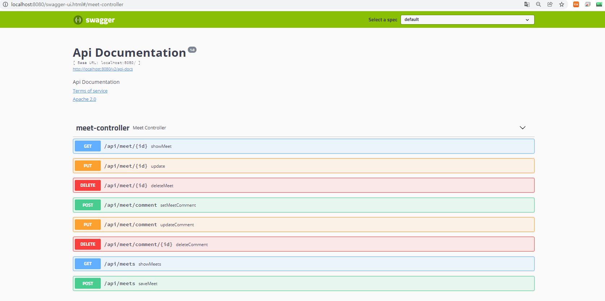

# 05_API를 작성하는 다양한 방법

## 1. GET API 만들기

```java
import org.springframework.web.bind.annotation.GetMapping;
import org.springframework.web.bind.annotation.RequestMapping;
import org.springframework.web.bind.annotation.RequestParam;
import org.springframework.web.bind.annotation.RestController;

@RestController
@RequestMapping("/api")
public class MyController {

    @GetMapping("/hello")
    public String hello(@RequestParam(value = "name", defaultValue = "World") String name) {
        return "Hello, " + name + "!";
    }
}
```
컨트롤러에 @RestController와 @requestMapping을 붙여 내부에 선언되는 메서드에서 사용할 공통 URL을 설정합니다.

스프링 4.3 버전 이후로는 새로나온 @GetMapping, @PostMapping, @PutMapping, @DeleteMapping을 사용하여 각 HTTP 메서드에 맞는 어노테이션을 사용하게 됩니다.

이와 함께 Talend API Tester에 주소를 입력한 뒤 send를 눌러주면 됩니다.

이 코드는 /api/hello 엔드포인트에 대한 GET 요청을 처리합니다. /hello 엔드포인트에 대한 매개변수로 name을 받아서 "Hello, {name}!" 형식의 응답을 반환합니다.

그런 다음 Talend API Tester 또는 다른 API 개발 도구를 사용하여 해당 엔드포인트에 요청을 보낼 수 있습니다. 요청 방법에 따라 파라미터를 포함하여 GET 요청을 보낼 수 있습니다. 이 예시에서는 name 파라미터를 전달하고 있습니다.

`URL: http://localhost:8080/api/hello?name=John`

## 2. @PathVariable을 활용한 GET 메서드 구현

```java
import org.springframework.web.bind.annotation.GetMapping;
import org.springframework.web.bind.annotation.PathVariable;
import org.springframework.web.bind.annotation.RequestMapping;
import org.springframework.web.bind.annotation.RestController;

@RestController
@RequestMapping("/api")
public class MyController {

    @GetMapping("/hello/{name}")
    public String hello(@PathVariable("name") String name) {
        return "Hello, " + name + "!";
    }
}
```

위의 코드에서 `/hello/{name}`은 `name`이라는 경로 변수를 가지는 엔드포인트를 정의합니다. 여기서 `@PathVariable("name")`은 URL에서 추출한 `name` 변수의 값을 메서드 매개변수에 주입합니다.

예를 들어, `/api/hello/John`에 대한 요청은 "Hello, John!"과 같은 응답을 반환합니다.

매개변수 이름을 `@PathVariable`의 값과 일치시키지 않고 싶다면 다음과 같이 작성할 수 있습니다.

```java
@GetMapping("/hello/{userName}")
public String hello(@PathVariable("userName") String name) {
    return "Hello, " + name + "!";
}
```

이제 `/api/hello/{userName}` 엔드포인트에 대한 요청은 `userName` 경로 변수의 값을 가져와서 해당 값을 사용할 것입니다.

## 3. @RequestParam을 활용한 GET 메서드 구현

```java
import org.springframework.web.bind.annotation.GetMapping;
import org.springframework.web.bind.annotation.RequestParam;
import org.springframework.web.bind.annotation.RestController;

import java.util.Map;

@RestController
public class MyController {

    @GetMapping("/api/hello")
    public String hello(@RequestParam("name") String name) {
        return "Hello, " + name + "!";
    }

    @GetMapping("/api/greet")
    public String greet(@RequestParam Map<String, String> params) {
        String name = params.get("name");
        return "Greetings, " + name + "!";
    }
}
```

위의 코드에서 `/api/hello` 엔드포인트는 단일 쿼리 매개변수인 `name`을 받아서 사용합니다. 이 경우 요청은 다음과 같이 될 것입니다: `/api/hello?name=John`

`/api/greet` 엔드포인트는 Map 객체를 사용하여 모든 쿼리 매개변수를 받습니다. 이것은 매개변수의 항목이 일정하지 않을 때 유용합니다. 이 경우 요청은 다음과 같이 될 것입니다: `/api/greet?name=John&age=30`

두 엔드포인트 모두 `name` 매개변수를 받고 있지만, `/api/hello`는 단일 매개변수를 받아서 사용하고 있고, `/api/greet`는 Map을 통해 모든 쿼리 매개변수를 받아서 사용합니다.

## 4. URI와 URL의 차이

URL은 "Uniform Resource Locator"의 약자로, 웹상에서 특정 리소스의 위치를 나타내는 문자열입니다. 일반적으로 URL은 다음과 같은 형식을 가집니다:

```
scheme://host:port/path?query#fragment
```

- `scheme`: 리소스에 접근하는 방법을 지정하는 프로토콜입니다. 예를 들어, `http`, `https`, `ftp` 등이 있습니다.
- `host`: 리소스가 호스팅되어 있는 서버의 도메인 이름이나 IP 주소입니다.
- `port`: 서버에 접속할 때 사용하는 포트 번호입니다. 일반적으로 생략될 수 있으며, 생략된 경우에는 기본 포트 번호가 사용됩니다.
- `path`: 서버 내의 리소스의 경로를 나타냅니다.
- `query`: 리소스에 전달되는 매개변수를 포함하는 부분입니다. 일반적으로 `key=value` 쌍으로 이루어져 있습니다.
- `fragment`: 리소스 내에서 특정 부분을 가리키는데 사용되는 정보입니다.

반면에 URI는 "Uniform Resource Identifier"의 약자로, 인터넷 상의 자원을 나타내는 유일한 주소를 말합니다. URL은 URI의 한 형태로, URI는 URL을 포함하며, 더 일반적인 개념입니다. URI는 리소스를 식별하기 위한 고유한 문자열을 의미합니다.

따라서 URL은 웹 주소를 나타내는 데 사용되며, 리소스가 어디에 있는지 알려주기 위한 경로를 포함합니다. 반면에 URI는 특정 리소스를 식별할 수 있는 식별자를 의미하며, URL은 URI의 한 형태입니다.

### 5. DTO 객체를 활용한 GET 메서드 구현

DTO는 Data Transfer Object의 약자입니다. 다른 레이어 간의 데이터 교환에 활용됩니다. DTO는 데이터를 교환하는 용도로만 사용하는 객체이기 때문에 DTO에는 별도의 로직이 포함되지 않습니다.

DTO 클래스에는 전달하고자 하는 필드 객체를 선언하고 getter/setter 메서드를 구현합니다. DTO 클래스에 선언된 필드는 컨트롤러의 메서드에서 쿼리 파라미터의 키와 매핑됩니다.
즉, 쿼리스트링의 키가 정해져있지만 받아야 할 파라미터가 많을 경우 이를 활용합니다.

```java

public class UserDTO {
    private Long id;
    private String username;
    private String email;

    // 생성자
    public UserDTO() {}

    // Getter 및 Setter 메서드
    public Long getId() {
        return id;
    }

    public void setId(Long id) {
        this.id = id;
    }

    public String getUsername() {
        return username;
    }

    public void setUsername(String username) {
        this.username = username;
    }

    public String getEmail() {
        return email;
    }

    public void setEmail(String email) {
        this.email = email;
    }
}

```

```java
import org.springframework.web.bind.annotation.GetMapping;
import org.springframework.web.bind.annotation.RequestParam;
import org.springframework.web.bind.annotation.RestController;

@RestController
public class UserController {

    @GetMapping("/api/user")
    public String getUserInfo(@RequestParam("id") Long id,
                              @RequestParam("username") String username,
                              @RequestParam("email") String email) {
        UserDTO userDTO = new UserDTO();
        userDTO.setId(id);
        userDTO.setUsername(username);
        userDTO.setEmail(email);

        // 이후에 userDTO를 사용하여 작업을 수행합니다.
        
        return "Received user info: " + userDTO.toString();
    }
}

```

위의 코드에서는 간단한 사용자 정보를 전송하기 위한 UserDTO 클래스를 정의하였습니다. 이 클래스에는 사용자의 고유 식별자인 id, 사용자명인 username, 이메일 주소인 email 세 가지 필드가 있습니다.

이제 이 DTO 클래스를 사용하여 클라이언트로부터 전달되는 요청의 파라미터와 매핑할 수 있습니다. 예를 들어, 다음은 Spring MVC에서 @RequestParam을 사용하여 요청 파라미터를 이 DTO 클래스와 매핑하는 방법을 보여줍니다.

위의 코드에서는 /api/user 엔드포인트에 대한 GET 요청을 처리하고, 클라이언트로부터 전달된 요청 파라미터를 UserDTO 객체에 매핑하고 있습니다. 이렇게 하면 클라이언트로부터 전달된 데이터를 편리하게 DTO 객체로 변환하여 사용할 수 있습니다.

### 6. POST API 만들기

POST API는 웹 애플리케이션을 통해 데이터베이스 등의 저장소에 리소스를 저장할 때 사용되는 API입니다.

POST API에서는 저장하고자 하는 리소스나 값을 HTTP 바디에 담아 서버에 전달합니다.

즉, POST 요청에서는 리소스를 담기 위해 HTTP Body에 값을 넣어 전송합니다. Talend API test에서 Body 영역에 값을 입력할 수 있습니다. 일반적으로 JSON 형식으로 전송됩니다.

@PostMapping을 @RequestMapping 대신 사용하면 method 요소를 정의하지 않아도 됩니다. DTO 객체를 매개변수로 삼아 작성할 수 있습니다. 

```java
import org.springframework.web.bind.annotation.PostMapping;
import org.springframework.web.bind.annotation.RequestBody;
import org.springframework.web.bind.annotation.RestController;

@RestController
public class PostController {

    @PostMapping("/api/resource")
    public String createResource(@RequestBody ResourceDTO resourceDTO) {
        // 받은 DTO 객체를 사용하여 작업을 수행합니다.
        // 예: 데이터베이스에 저장
        
        return "Resource created successfully: " + resourceDTO.toString();
    }
}

```

### 7. PUT API 만들기

PUT API는 웹 애플리케이션 서버를 통해 데이터베이스 같은 저장소에 존재하는 리소스 값을 업데이트 하는데 사용합니다.

ResponseEntity를 활용하여 서버에 들어온 요청에 대해 응답 데이터를 구성해서 전달할 수 있습니다. 이 클래스를 활용하면 응답 코드 변경은 물론 Header와 Body를 더욱 쉽게 구성할 수 있습니다. 

```java
import org.springframework.http.HttpStatus;
import org.springframework.http.ResponseEntity;
import org.springframework.web.bind.annotation.PutMapping;
import org.springframework.web.bind.annotation.RequestBody;
import org.springframework.web.bind.annotation.RestController;

@RestController
public class UpdateController {

    @PutMapping("/api/resource/{id}")
    public ResponseEntity<String> updateResource(@PathVariable Long id, @RequestBody ResourceDTO resourceDTO) {
        // 주어진 ID를 사용하여 리소스를 업데이트합니다.
        // 예: 데이터베이스에서 해당 ID에 해당하는 리소스를 찾아 업데이트
        
        // 업데이트가 성공했을 경우
        return ResponseEntity.ok("Resource with ID " + id + " updated successfully");

        // 업데이트가 실패했을 경우
        // return ResponseEntity.status(HttpStatus.INTERNAL_SERVER_ERROR).body("Failed to update resource");
    }
}

```

위의 코드에서는 /api/resource/{id} 엔드포인트에 대한 PUT 요청을 처리하고 있습니다. 

@RequestBody 애노테이션을 사용하여 요청의 바디에 있는 데이터를 ResourceDTO 객체로 자동으로 변환하여 받아옵니다. 

그리고 ResponseEntity를 사용하여 업데이트 작업의 결과에 따라 적절한 응답을 클라이언트에게 전송합니다.


### 8. DELETE API 만들기

DELETE API는 웹 애플리케이션 서버를 거쳐 데이터베이스 등의 저장소에 있는 리소스를 삭제할 때 사용합니다. 서버에서는 클라이언트로부터 리소스를 식별할 수 있는 값을 받아 데이터베이스나 캐시에 있는 리소스를 조회하고 삭제하는 역할을 수행합니다.

@DeleteMapping 어노테이션에 정의한 value의 이름과 메서드의 매개변수 이름을 동일하게 설정해야 삭제할 값이 주입됩니다. 또는 @RequestParam 어노테이션을 통해 쿼리스트링 값도 받을 수 있습니다. 

```java

import org.springframework.web.bind.annotation.DeleteMapping;
import org.springframework.web.bind.annotation.PathVariable;
import org.springframework.web.bind.annotation.RestController;

@RestController
public class DeleteController {

    @DeleteMapping("/api/resource/{id}")
    public String deleteResource(@PathVariable Long id) {
        // 주어진 ID를 사용하여 리소스를 삭제합니다.
        // 예: 데이터베이스에서 해당 ID에 해당하는 리소스를 삭제
        
        return "Resource with ID " + id + " deleted successfully";
    }
}

```

위의 코드에서는 /api/resource/{id} 엔드포인트에 대한 DELETE 요청을 처리하고 있습니다. 

@PathVariable 애노테이션을 사용하여 경로 변수로부터 삭제할 리소스의 ID를 받아옵니다. 

그리고 해당 ID를 사용하여 리소스를 삭제하고, 삭제 결과에 대한 응답을 클라이언트에게 반환합니다.

### 9. Swagger의 존재

Swagger는 API 명세를 작성하고 관리하는 데 도움을 주는 오픈 소스 프로젝트입니다. Swagger를 사용하면 API의 설명, 요청 및 응답의 형식, 예시 등을 문서화하여 개발자들이 API를 쉽게 이해하고 사용할 수 있습니다.

Swagger를 Spring Boot 프로젝트에 통합하기 위해서는 일반적으로 Maven이나 Gradle과 같은 빌드 관리 도구를 사용하여 의존성을 추가해야 합니다. 그리고 SwaggerConfiguration 클래스를 작성하여 Swagger를 구성하고 사용할 수 있습니다.

아래는 Spring Boot 프로젝트에서 Swagger를 사용하기 위한 간단한 설정 방법입니다.

1. `pom.xml` 파일에 Swagger 관련 의존성 추가:

```xml
<dependency>
    <groupId>io.springfox</groupId>
    <artifactId>springfox-boot-starter</artifactId>
    <version>3.0.0</version>
</dependency>
```

2. Swagger를 구성하기 위한 `SwaggerConfiguration` 클래스 작성:

```java
import org.springframework.context.annotation.Bean;
import org.springframework.context.annotation.Configuration;
import springfox.documentation.builders.PathSelectors;
import springfox.documentation.builders.RequestHandlerSelectors;
import springfox.documentation.spi.DocumentationType;
import springfox.documentation.spring.web.plugins.Docket;
import springfox.documentation.swagger2.annotations.EnableSwagger2;

@Configuration
@EnableSwagger2
public class SwaggerConfiguration {

    @Bean
    public Docket api() {
        return new Docket(DocumentationType.SWAGGER_2)
                .select()
                .apis(RequestHandlerSelectors.basePackage("com.example.controller"))
                .paths(PathSelectors.any())
                .build();
    }
}
```

위의 코드에서 `RequestHandlerSelectors.basePackage`는 Swagger가 문서화할 컨트롤러 클래스가 있는 패키지를 지정합니다. 따라서 이 부분을 프로젝트의 실제 패키지로 변경해야 합니다.

3. Spring Boot 애플리케이션을 실행하고 브라우저에서 `http://localhost:8080/swagger-ui/`로 접속하면 Swagger UI를 통해 API 명세를 확인할 수 있습니다.

Swagger를 사용하면 API 명세를 자동으로 생성하고 문서화할 수 있으므로 개발자들이 API를 사용하기 쉽고 효율적으로 이해할 수 있습니다.



### 10. 로깅 라이브러리

로깅이란 애플리케이션이 동작하는 동안 시스템의 상태나 동작 정보를 시간순으로 기록하는 것을 의미합니다. 로깅은 개발 영역 중 ‘비기능 요구사항’에 속합니다. 하지만 로깅은 디버깅하거나 개발 이후 발생한 문제를 해결할 때 원인을 분석하는 데 꼭 필요한 요소입니다.

자바 진영에서 가장 많이 사용되는 로깅 프레임워크는 Logback입니다. 스프링 부트의 spring-boot-starter-web 라이브러리 내부에 내장돼 있어 별도의 의존성을 추가하지 않아도 사용할 수 있습니다.

크게 5개의 로그레벨(TRACE, DEBUG, INFO, WARN, ERROR)을 설정할 수 있습니다.

Logback 설정 파일은 리소스 폴더 안에 생성합니다. 파일명은 주로 logback-spring.xml 파일을 참조합니다. Property 영역, Appender 영역, Encoder 영역, Pattern 영역, Root 영역으로 나뉩니다.


먼저, Logback 설정 파일을 생성합니다. 일반적으로 `src/main/resources` 폴더에 `logback-spring.xml` 파일을 생성합니다. 이 파일을 통해 로그레벨, 출력 형식, 로그 파일 위치 등을 설정할 수 있습니다.

예를 들어, 다음은 간단한 Logback 설정 파일의 예시입니다.

```xml
<configuration>

    <!-- Appender 설정 -->
    <appender name="CONSOLE" class="ch.qos.logback.core.ConsoleAppender">
        <encoder>
            <pattern>%d{yyyy-MM-dd HH:mm:ss} [%thread] %-5level %logger{36} - %msg%n</pattern>
        </encoder>
    </appender>

    <!-- Root Logger 설정 -->
    <root level="INFO">
        <appender-ref ref="CONSOLE" />
    </root>

</configuration>
```

위의 설정 파일에서는 콘솔에 로그를 출력하는 간단한 설정을 보여줍니다. `%d`, `%thread`, `%level`, `%logger`, `%msg` 등의 패턴을 사용하여 로그 메시지의 형식을 지정할 수 있습니다.

다음은 각 영역에 대한 설명입니다.
- **Appender 영역**: 로그의 출력 형식을 설정하고 어떤 방법으로 출력할지를 결정합니다. 콘솔 출력(`ConsoleAppender`)뿐만 아니라 파일 출력(`FileAppender`) 등 다양한 방법으로 설정할 수 있습니다.
- **Logger 영역**: 로거를 설정합니다. 로거는 클래스에 대한 로깅을 관리하는 객체입니다. 각 클래스마다 로거를 정의하여 로깅을 수행합니다.
- **Level 설정**: TRACE, DEBUG, INFO, WARN, ERROR 등 다섯 가지의 로그 레벨을 설정할 수 있습니다. 해당 레벨보다 높은 레벨의 로그만 출력됩니다.

예를 들어, `Logger.info("로그 메시지");`를 호출하면 INFO 레벨의 로그 메시지가 출력됩니다. 중괄호 `{}` 안에는 변수의 값이 들어갈 수 있습니다. 이러한 방식으로 로그 메시지를 동적으로 생성할 수 있습니다.

로그 레벨은 해당 레벨보다 낮은 레벨의 로그도 출력됩니다. 즉, INFO 레벨의 로그를 설정하면 INFO 레벨부터 ERROR 레벨까지의 로그가 출력됩니다.

Logback을 사용하면 스프링 부트 애플리케이션에서 로깅을 쉽게 설정하고 관리할 수 있습니다.

